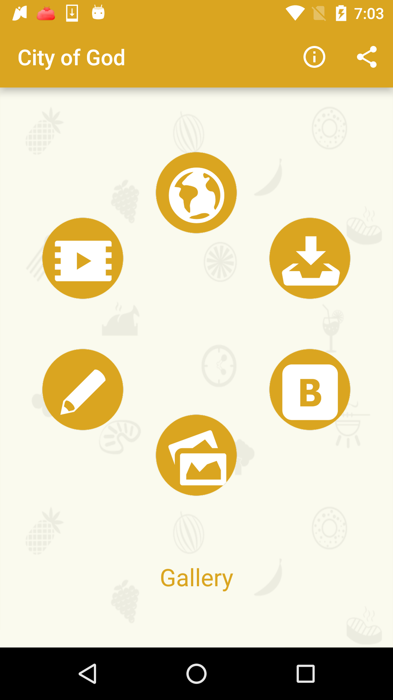
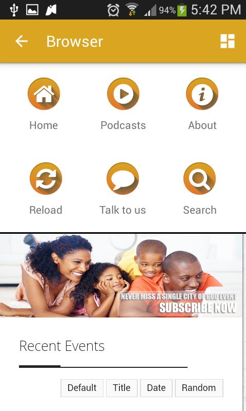
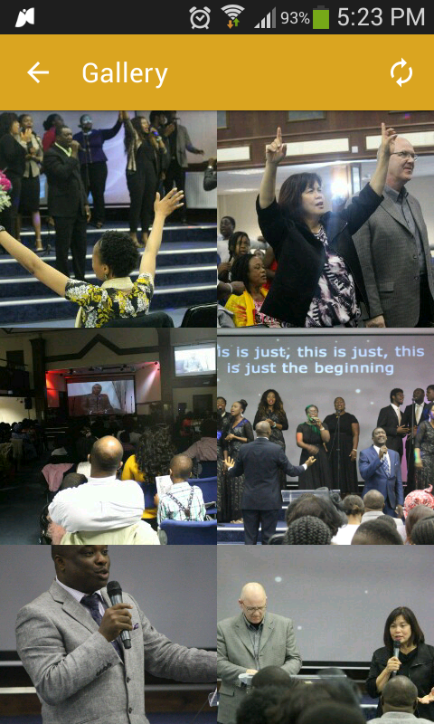
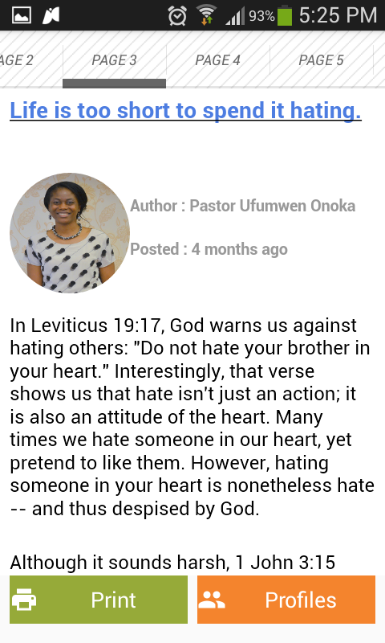
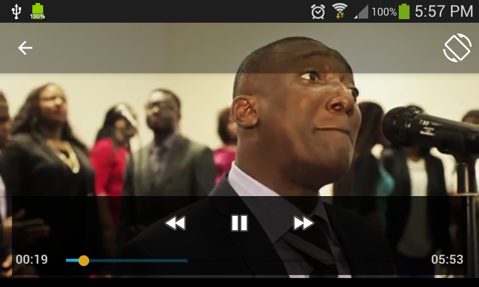
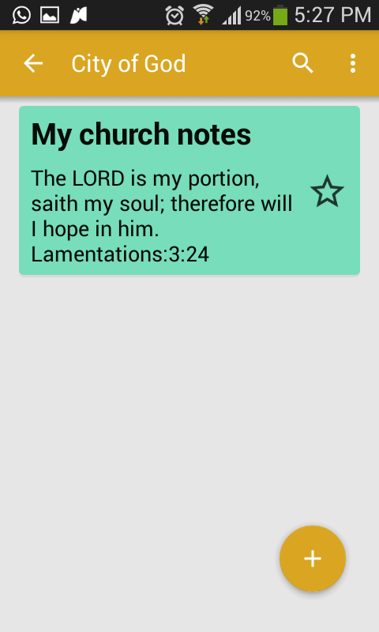
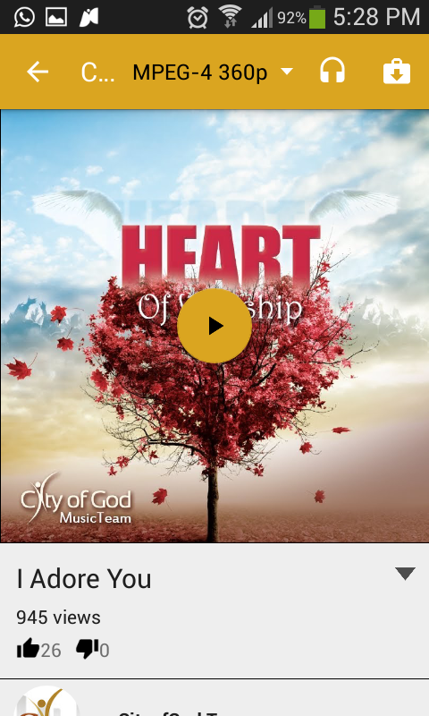

# ChurchAppTemplate
Take advantage of useful features relevant to a church apps. (Video 

player like youtube, download videos, fetch blog info, load gallery images, take and 

save notes, open church website with custom icons, beautiful about page). Find 

attached php server files and mysql database script. Have fun!

# Classes
This project 

has classes that will help you choose what you want in your app
1. Blog classes
2. Video Players
3. Notes Classes
4. Gallery Classes
5. Website (WebView Classes)
6. PHP files 

(with mysql script)

# Screen Shots

# Author : Levit Nudi 

